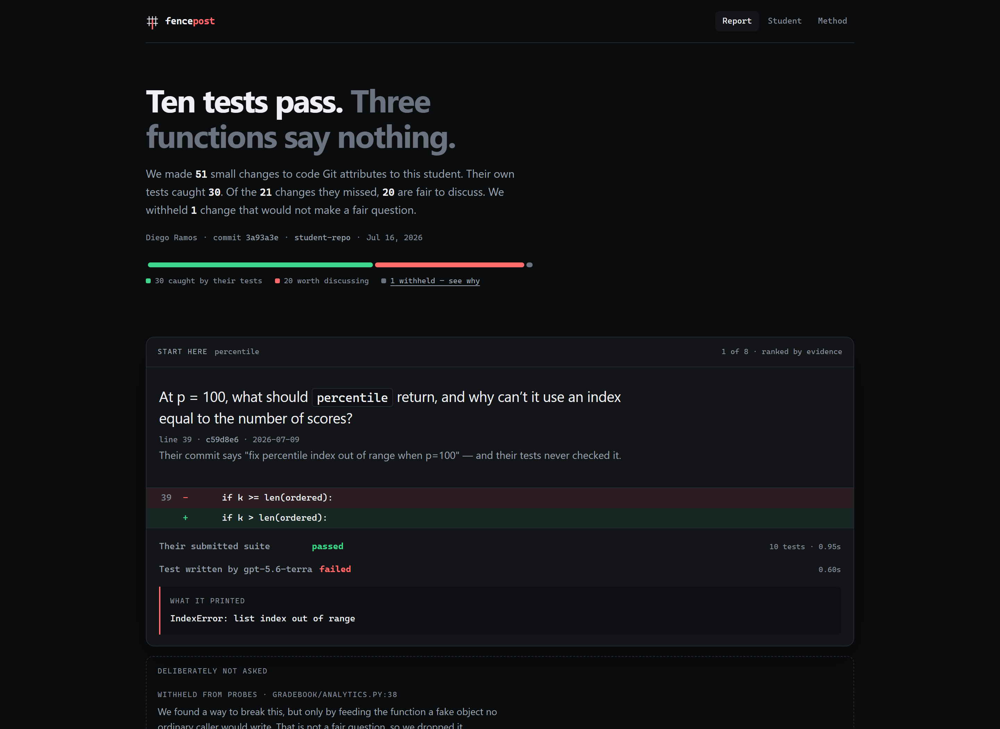
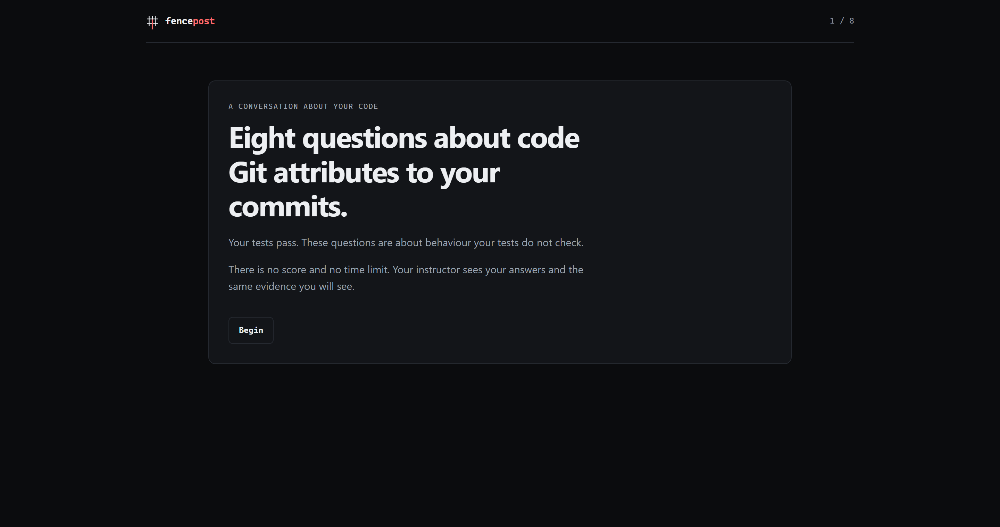

<div align="center">

# fencepost

**A comprehension probe for programming courses, for the era where a coding agent can do the assignment.**

Fencepost changes a line the student wrote, runs their own tests against the change, and asks about what survives.
Every question is grounded in a test run. Never in a model's opinion.

*Built for OpenAI Build Week — Education track — with Codex and GPT-5.6.*

**[Watch the 2-minute demo](https://youtu.be/0sWIWBWEmkA)**



</div>

---

## The problem

A student's submission passes every test. Did they understand it, or did an agent write it?

Detection is the wrong question. AI-detection for code does not work, it is adversarial toward students, and it punishes the honest student who used an agent well. So instructors quietly stop assigning take-home programming work, and they have nothing to replace it with.

Fencepost does not detect. It assumes the student used an agent, and asks the question detection cannot answer:

> **Does this student understand the code in their repo?**

That question is answerable, it is defensible in a hearing, and it is useful even for the student who wrote every line themselves.

## How it works

```
┌─ 1 ATTRIBUTE ──────────────────────────────────────────────────────────┐
│  git blame -M -C -C -w   →  lines Git attributes solely to the student  │
│  co-authored commits and cherry-picks are excluded, with the reason     │
└────────────────────────────────┬───────────────────────────────────────┘
┌─ 2 SELECT ─────────────────────▼───────────────────────────────────────┐
│  keep the lines their own tests actually execute                        │
│  below 50% authored-line coverage → "we cannot assess this"             │
└────────────────────────────────┬───────────────────────────────────────┘
┌─ 3 MUTATE ─────────────────────▼───────────────────────────────────────┐
│  AST operators via ast.unparse — one node change per mutant             │
│  comparison · boundary · arithmetic · boolean · return · constants      │
└────────────────────────────────┬───────────────────────────────────────┘
┌─ 4 EXECUTE ────────────────────▼───────────────────────────────────────┐
│  their pytest suite vs each mutant, in Docker (--network none)          │
│    killed    → their tests caught it.  We stay silent.                  │
│    survived  → a comprehension gap, or an equivalent mutant.            │
└────────────────────────────────┬───────────────────────────────────────┘
┌─ 5 TRIAGE ─────────────────────▼───────────────── the core ────────────┐
│  Codex + GPT-5.6 write adversarial tests to distinguish each survivor   │
│    STRICT    anything Python allows                                     │
│    CONTRACT  only what a real caller could write (AST-enforced)         │
│  killed → REAL GAP. never killed → PROBABLE EQUIVALENT. We stay silent. │
└────────────────────────────────┬───────────────────────────────────────┘
┌─ 6 PROBE ──────────────────────▼───────────────────────────────────────┐
│  one question per site, from CONTRACT gaps only                         │
│  grounded in the authored line and its commit                           │
└────────────────────────────────┬───────────────────────────────────────┘
┌─ 7 REPORT ─────────────────────▼───────────────────────────────────────┐
│  formative · human in the loop · every claim traceable to a run         │
└────────────────────────────────────────────────────────────────────────┘
```

## What makes this different from prior work

Two published systems already give AI oral exams over student code. A reviewer finds them in thirty seconds — so did we:

- **[Scalable and Personalized Oral Assessments Using Voice AI](https://arxiv.org/abs/2603.18221)** (Ipeirotis & Rizakos, NYU). Voice oral exams graded by a panel of three LLMs, deployed on two real cohorts. Their system is also called *Viva*. It does **not** read git history and does **not** execute code.
- **[AI-Driven Oral Examinations for Code Assessment](https://dl.acm.org/doi/10.1145/3770761.3777032)** (Tregubov & Sow Traore, Dartmouth, SIGCSE 2026). AI oral exams over student submissions.

Fencepost does three things neither does:

| | |
|---|---|
| **Line-level attribution** | `git blame -M -C -C -w` isolates the lines Git attributes to *this student*. A question grounded in the instructor's scaffold destroys credibility instantly. Ours cite the commit and the date. |
| **Mutation as an active probe** | We do not ask a student to explain their code. We *change* it and ask what breaks. **A question about a mutant that does not exist on disk cannot be answered by pasting the file into a chatbot.** |
| **Execution as ground truth** | The mutant runs against the real suite. The failing assertion *is* the answer key. The model phrases the question and grades the reply; it never decides what is true. |

## The finding: equivalence is relative to a contract

A surviving mutant is either a real gap or an **equivalent mutant** — behavior genuinely unchanged, so there is nothing to catch. Distinguishing them is undecidable in general, and it is the first thing a skeptical reviewer asks, because a tool that flags equivalents asks students unanswerable questions.

We resolved it empirically, and it refuted us. Twice.

We planted a mutant we could prove was equivalent: in a clamp, `if p > 100: p = 100` mutated to `p >= 100`. At exactly 100 both return 100. We checked.

We were wrong. **GPT-5.6 killed it with negative zero:**

```python
assert str(clamp_percent(-0.0)) == "-0.0"
```

`-0.0 < 0` is false, so the original returns `-0.0` untouched. The mutant's `<=` fires and returns the int `0`. **`p = 100` is never a no-op** — it replaces the caller's object with an int literal, and `str()` reveals it with plain values and no introspection.

Then it killed the arithmetic mutant (`/` → `//`) by **monkeypatching our clamp away**, letting a negative numerator reach the division. But `percentile` always clamps first, so that state is unreachable in the real program. We verified exhaustively: with the clamp intact, `int(n*p/100)` and `int(n*p//100)` differ **zero times across ~36,180 combinations**.

> **A test that replaces part of the program is no longer evidence about the program.**

So equivalence is only meaningful relative to a stated contract. Fencepost reports two rates and never presents either as the truth:

| mode | the generator may use | measured on the fixture |
|---|---|---|
| **strict** | anything Python allows | 21 real gaps, 0 equivalent — **0.000** |
| **contract** | only what a real caller could write, enforced by an auditable AST policy | 20 real gaps, 1 equivalent — **0.048** |

The difference is the set of questions we chose *not* to ask. Probe questions come only from contract-mode gaps, and the report's **"Deliberately not asked"** section shows exactly what was suppressed and why.

**Stated limitation:** contract mode can hide a genuine gap when the only possible witness is a type or identity check. That is a deliberate false-negative trade, printed beside the number, not buried.

## What Git cannot tell us

The product rests on one claim — *this line is theirs* — so we tested it against real adversarial histories instead of asserting it.

| history | what Fencepost does |
|---|---|
| Co-authored commit (`Co-authored-by:`) | **detected**, excluded from probes, reason kept |
| Cherry-pick | **detected** via author/committer mismatch, excluded |
| Rebase | retained, mismatch surfaced as a signal |
| Instructor scaffold moved by the student | **correctly traced** to the instructor |
| **Pair programming** (partner drove, student committed) | **WRONG.** Looks solely the student's. No signal exists. |
| **Squash merge** | **WRONG.** Same. |
| **Cross-file copy** in a small history | **WRONG.** No `-C` signal to detect it. |

Those three failures are asserted by tests so they are documented rather than discovered by an instructor. `git blame` cannot see who was at the keyboard, and the report says so where the instructor reads the questions.

## The two views

| | |
|---|---|
|  |  |
| **The instructor** decides whether a 3-minute conversation is worth having. The question is the hero; the student's name lives in the metadata. | **The student** answers *before* seeing any evidence. The mutant is not in the page, not in the DOM, and `/reveal/N` returns 403 without an answer. |

The student's answer is committed before the reveal, because an answer given after seeing the evidence is worth nothing. There is no score, no verdict, and the red is on the assertion, never on the student.

## Setup

Requires **Python 3.12+**, **Docker** running, and the **Codex CLI** signed in to a ChatGPT plan.

```bash
pip install -e .
npm install -g @openai/codex && codex login
docker build -f docker/runner.Dockerfile -t fencepost-runner:local .
```

## Run it

```bash
python demo/build_demo_repo.py demo/student-repo      # the synthetic student submission

fencepost demo/student-repo \
  --student-email d.ramos@alumnos.ejemplo.edu \
  --output .fp_run \
  --generator codex \
  --adversarial-model gpt-5.6-terra

fencepost serve .fp_run     # instructor: landing, /report, /method
fencepost probe .fp_run     # student: answer, then see the evidence
```

A full real run is **~20 minutes and ~45 Codex calls** — every survivor is triaged in both modes.

**To evaluate it without spending a single Codex call**, the hermetic gates run the entire pipeline with a deterministic generator:

```bash
pytest tests/integration                   # 2 Docker gates, no model calls, ~2 min
pytest tests --ignore=tests/integration    # 66 unit tests, no Docker, ~8 s
```

Those gates assert the fixture's known ground truth end to end. You can reproduce every number in this README without an API key.

## The sample data

`demo/build_demo_repo.py` builds a CS2 gradebook assignment: an instructor scaffold commit, then a week of student commits. **The student's 10 tests all pass.** Known ground truth, documented in [`AGENTS.md`](AGENTS.md) and verified by the gates:

- **`letter_grade`** — the boundary mutants survive. A student scoring exactly **90 gets a B**.
- **`percentile`** — the student's own commit is titled *"fix percentile index out of range when p=100"*. Remove their fix and their tests never notice. **They built the fence and never checked it.**
- **`rank`, `top_n`** — their mutants are **killed**. Fencepost stays silent. A tool that flags everything found nothing.

Measured: **51 eligible mutants → 30 killed by the student's own suite → 21 survivors → 8 sites → 8 questions.**

## How Codex and GPT-5.6 were used

**Codex wrote the engine.** All 8,886 lines across 18 modules, over 22 commits, in one Codex session — `gpt-5.6-terra` for mechanical work, `gpt-5.6-sol` for design and the hard reasoning. The spec ([`AGENTS.md`](AGENTS.md)), the demo fixture, the design direction ([`docs/design/`](docs/design/)), this README and the video are the human's.

**Codex also runs *inside* the product.** Stages 5 and 6 shell out to `codex exec -m gpt-5.6-terra` with structured output to write adversarial tests and probe questions at runtime. **No API key** — it runs on the instructor's own ChatGPT plan, which is the only way a tool like this gets installed in a department. The credential stays host-side; only the generated test string crosses into the sandbox.

Where the decisions were made, honestly:

- Codex **solved the hardest design problem correctly on the first try**: `ast.unparse` reformats the file, so mutant line numbers cannot map back to blame. It refused to try, and used two coordinate systems joined by a structural AST path.
- Codex **caught a flaw in the human's fixture** that the human had missed, and its rule — *blame filters what we mutate, not which tests we run* — is now spec.
- The human **caught Codex's sandbox contradiction**: it mounted `/workspace` read-only and then ran a syntax check that writes `__pycache__`, so all 287 mutants came back `broken`. Codex reported the gate as failing but blamed Docker; running the gate ourselves found the real cause.
- Codex **reported 287 mutants as a passing assertion without verifying it**. The honest number was 40, then 51. It owned the mistake and refused to fabricate an explanation for where 287 came from.
- **GPT-5.6 refuted the humans twice** on equivalence — negative zero, then a monkeypatch — and we caught it cheating the third time.

That last one is the project in miniature: a human and two models were confident and wrong, and the test run settled it. Which is exactly what Fencepost does to a student's green suite.

**The demo film was built the same way.** The pipeline under [`tools/`](tools/) and [`video/`](video/) is a Remotion (video-as-React) project fed by a set of small tools, and it holds the project's honesty rule even where nobody would check: the on-screen diff, line numbers, commit subject, and the 51/30/21 counts are read from a real run by [`tools/film_facts.py`](tools/film_facts.py) — an earlier cut hand-typed a diff that did not exist, and the fix was to stop typing facts. The voiceover is verified by transcribing it back with Whisper so a model name that does not survive synthesis fails the build ([`tools/make_vo.py`](tools/make_vo.py)), and the Codex shot in the film is the real stage-5 call captured through the product's own request builder ([`tools/capture_codex_shot.py`](tools/capture_codex_shot.py)), not a re-typed lookalike.

## Security

The student's repo and every model-generated test are untrusted input. They execute in Docker with `--network none`, a read-only root filesystem, a read-only source mount, all capabilities dropped, `no-new-privileges`, a non-root user, and memory/CPU/PID limits.

Two independent audits reviewed this codebase. Both findings are fixed:

- a **TOCTOU tar-slip** in archive extraction that ran **on the host** — a crafted symlink in a student repo could write outside the sandbox;
- untrusted code sharing write access to the results directory, which would have let **the code under test forge its own ground truth**. `/out` is no longer mounted; results return through the trusted driver.

## What this is not

- **Not a detector.** No AI-detection anywhere in the product, the copy, or the report.
- **Not summative.** Advisory, for an instructor to read. It is not a grade and must not be used as one.
- **Not multi-language.** Python + pytest only. One language done properly beats three done badly.
- **Not a replacement for talking to your students.** It is a reason to.

## License

MIT.
